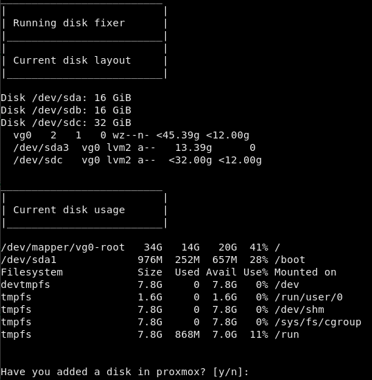
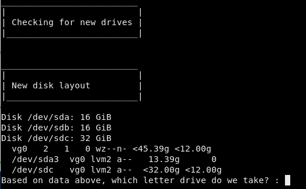
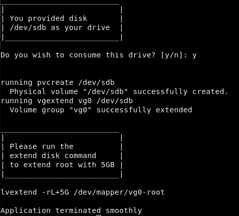

# Tools presented
* diskfix.sh 

## diskfix.sh
Scans for new sd devices added via hypervisor, then on user input adds to lvm and allows for disk expansion command to be run

__IF YOU ADD THE WRONG DISK__

run the command vgreduce /dev/sdwhateverdiskyouusedwrong

